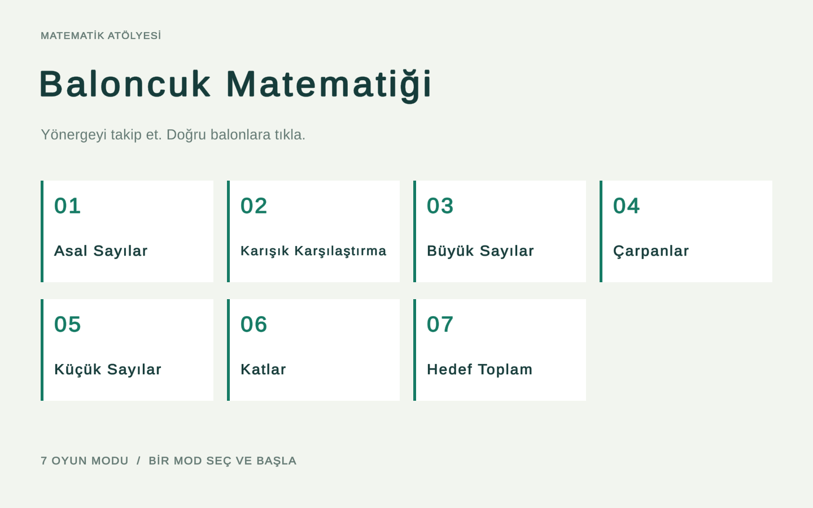
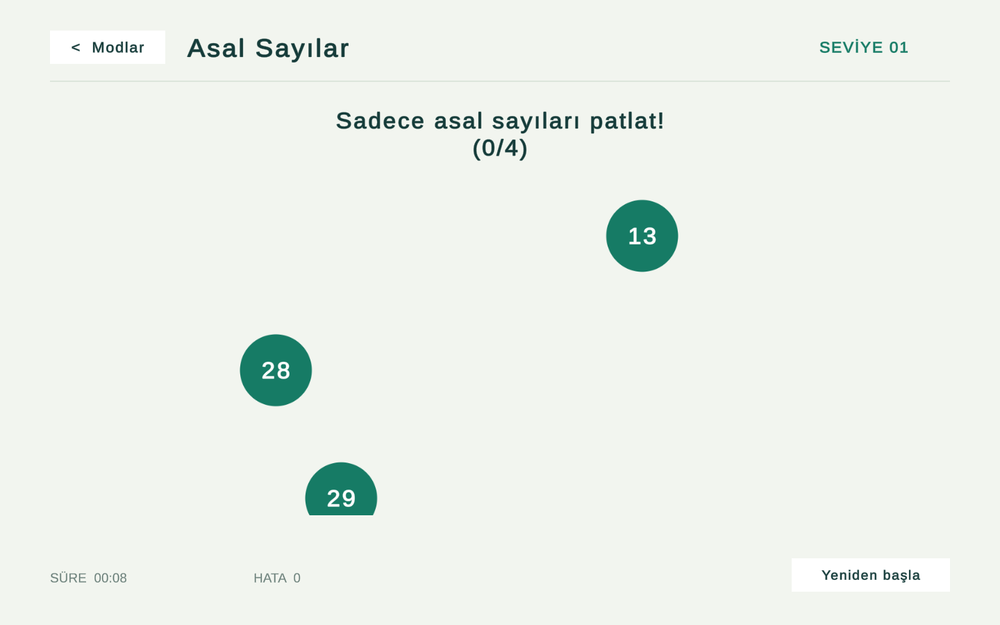
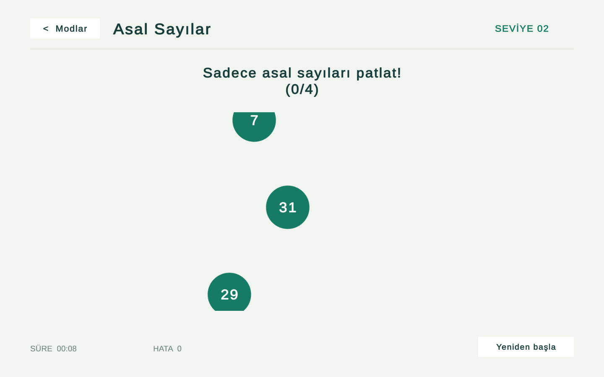
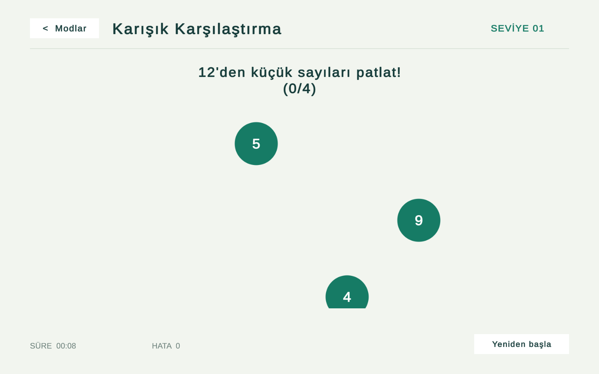
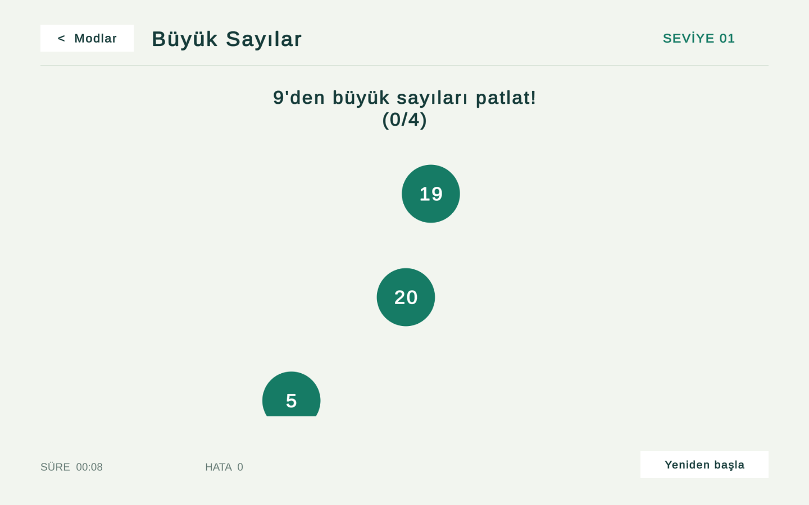
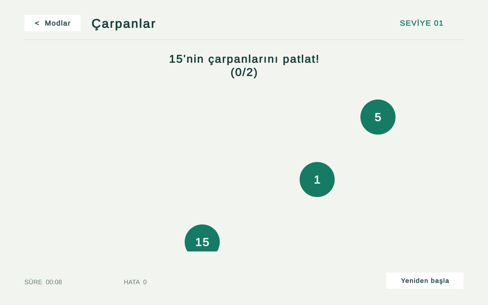
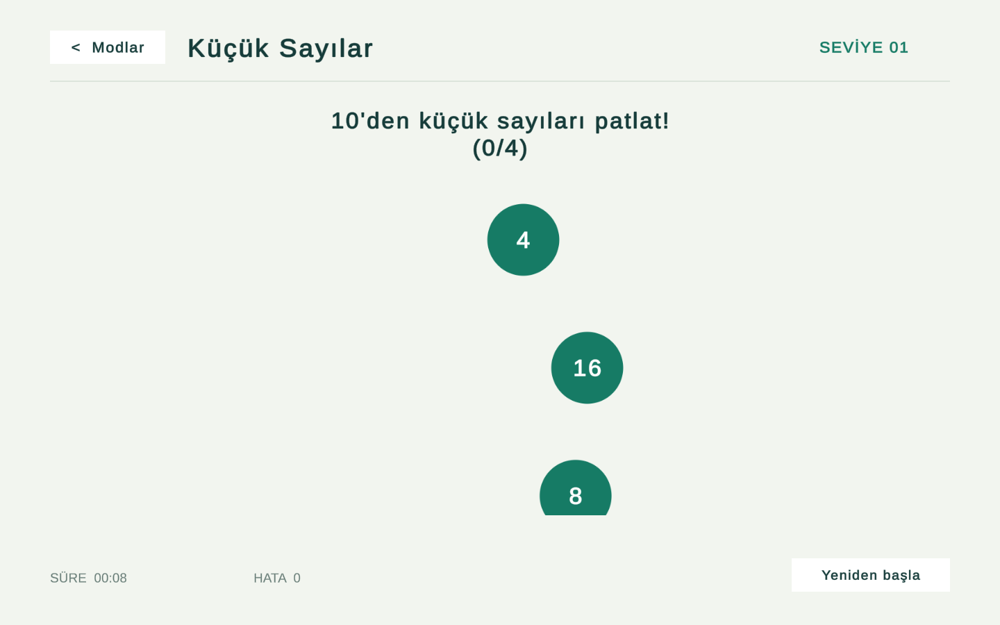
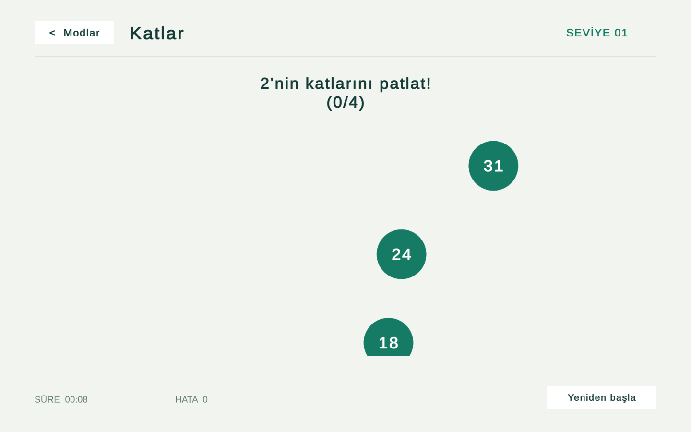
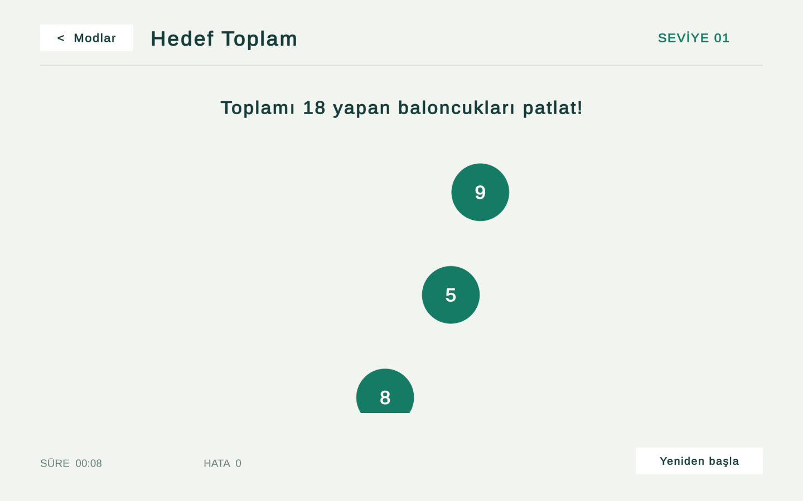

# Bubble Math

A Unity and C# arithmetic game with moving number bubbles. Identify primes, factors and multiples, compare values, or combine numbers to reach a target sum.

**Game design and development: [Ufuk Bayhan](https://github.com/UfukBayhan)**

The in-game interface remains in Turkish. This repository contains a standalone portfolio edition with simple UI artwork and no account or server dependency.

## Gameplay

Follow the instruction and click the correct moving numbers. In target-sum mode, selected values accumulate until they reach the target; exceeding it clears the selection. Other modes ask for a number of correct pops. Complete the goal to advance.

The HUD shows the current level, elapsed time and mistakes. **Modlar** (Modes) or **Escape** returns to mode selection. **Yeniden başla** (Restart) resets the current mode to its first level.

## Modes

| Mode | Scene |
| --- | --- |
| Prime numbers | `AsalSayilariPatlat` |
| Mixed comparisons | `BuyukKucukPatlatma` |
| Greater than | `BuyukPatlatma` |
| Factors | `CarpanlariPatlat` |
| Less than | `KucukPatlatma` |
| Multiples | `SayininKatlariPatlat` |
| Target sum | `ToplamlariPatlat` |

## Screenshots

Captured from the running Windows development build. These show actual gameplay in different modes and levels.

### Prime numbers

### Mixed comparisons

### Greater than

### Factors

### Less than

### Multiples

### Target sum

## Getting started

1. Clone this repository or download it as a ZIP archive.
2. Add the project folder through Unity Hub.
3. Open it with **Unity 6000.3.9f1** and allow package imports to finish.
4. Open `Assets/Game/Scenes/ModeSelect.unity` and press **Play**.
5. Select a mode and follow its instructions.

The editor opens the mode-selection scene automatically when starting from a clean, unnamed empty scene. You can also use **Portfolio → Open Mode Selection**. If the Game tab is missing, use **Window → General → Game**.

## Project structure

| File / folder | Purpose |
| --- | --- |
| `Assets/Game/Scenes` | Mode selection and individual game scenes |
| `BubblePopMathGame.cs` | Core game rules, generation and progression |
| `StemGameManager.cs` | Shared local session management |
| `SessionHud.cs` | Level, time, mistakes and restart |
| `ModeNavigation.cs` | Mode selection links |
| `FeedbackEffect.cs` | Answer feedback and short generated tones |
| `Assets/Resources/PortfolioConfig.json` | Mode settings and labels |
| `Assets/Editor/PortfolioBuilder.cs` | Scene generation and Windows build tool |

The original value generators, pooled bubbles and difficulty curves are retained. Movement is adapted to canvas coordinates; already-selected bubbles and input during transitions are ignored.

UI elements are built with Unity UI and TextMesh Pro. Scene and script metadata is included for reproducible Unity imports.

## Build and validation

Use **File → Build Profiles** with the Windows target. The enabled scene list includes `ModeSelect` first, followed by all game modes. Build outputs, local logs and Unity caches are excluded from Git.

`PortfolioBuilder.Build` generates scenes and creates `Builds/Windows/Game.exe`. **It overwrites generated scenes**, so commit or back up manual scene edits before using it.

Run the development player with `--portfolio-checks` to execute the opt-in checks and capture the gallery under `Docs` when using the default build location. The checks exercise UI callbacks, accelerate time where needed, and do not run during normal gameplay. They are not a substitute for testing physical touch or keyboard input on every device.

Automated Windows-player checks passed for all 7 modes (94 assertions). Checks cover mode navigation, answer behavior, repeated input, level progression, restart and menu return.

Validation targets Windows. Mobile-device testing has not been performed.

## Third-party components

Liberation Sans is distributed under the SIL Open Font License. Its license is included at `Assets/TextMesh Pro/Fonts/LiberationSans - OFL.txt`. Existing Unity and TextMesh Pro notices are preserved.

This repository is shared for portfolio presentation and review. No separate open-source license has been granted.
